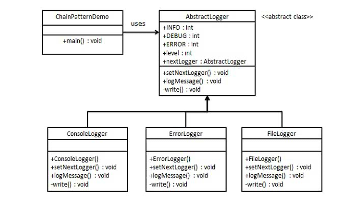

## Introduction ##
This pattern lets us pass requests along a chain of handlers. 
Upon receiving a request, each handler decides either to process the request or to pass it to the next handler in the chain.

## Design consideration ##
- Chain of receiver objects 
- Each handle is based on the main interface which defines the contract between each chain links
- ConcreteHandler for each receiver or implementation that will interpret the request.
- Each handler has a reference ot the next

## UML design consideration ##
### UML design 1 ###
