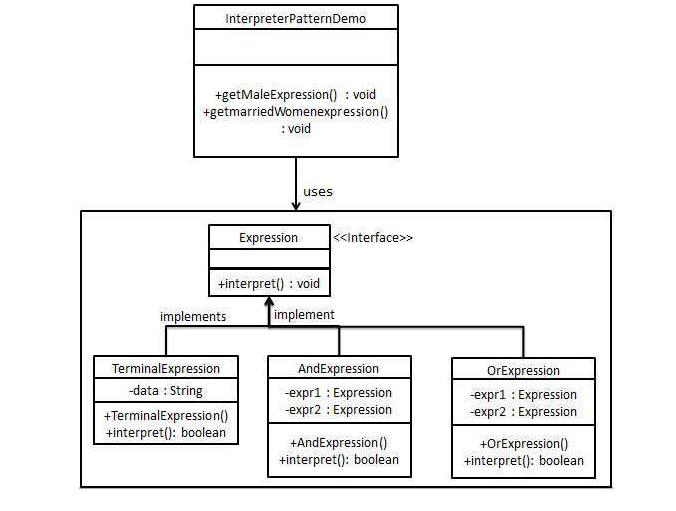

## Introduction ##

## Example of interpreter pattern in Java ##
```java
java.util.Pattern
java.text.format
```

## Design consideration ##
- AbstractExpression (Expression): Declares an interpret() operation that all nodes (terminal and nonterminal) in the AST overrides.
- TerminalExpression (NumberExpression): Implements the interpret() operation for terminal expressions.
- NonterminalExpression (AdditionExpression, SubtractionExpression, and MultiplicationExpression): Implements the interpret() operation for all nonterminal expressions.
- Context (String): Contains information that is global to the interpreter. It is this String expression with the Postfix notation that has to be interpreted and parsed.
- Client (ExpressionParser): Builds (or is provided) the AST assembled from TerminalExpression and NonTerminalExpression. The Client invokes the interpret() operation.

## UML design ##


## Example ##
### Example 1 ###
```java
interface Expression 
{ 
    boolean interpreter(String con); 
}
```

```java
// TerminalExpression class implementing 
// the above interface. This interpreter  
// just check if the data is same as the  
// interpreter data. 
class TerminalExpression implements Expression  
{ 
    String data; 
  
    public TerminalExpression(String data) 
    { 
        this.data = data;  
    } 
  
    public boolean interpreter(String con)  
    { 
        if(con.contains(data)) 
        { 
            return true; 
        } 
        else
        { 
            return false;   
        } 
    } 
} 
```

```java
// OrExpression class implementing 
// the above interface. This interpreter  
// just returns the or condition of the  
// data is same as the interpreter data. 
class OrExpression implements Expression  
{ 
    Expression expr1; 
    Expression expr2; 
  
    public OrExpression(Expression expr1, Expression expr2)  
    { 
        this.expr1 = expr1; 
        this.expr2 = expr2; 
    } 
    public boolean interpreter(String con)  
    {         
        return expr1.interpreter(con) || expr2.interpreter(con); 
    } 
} 
```
```java
  
// AndExpression class implementing 
// the above interface. This interpreter  
// just returns the And condition of the  
// data is same as the interpreter data. 
class AndExpression implements Expression  
{ 
    Expression expr1; 
    Expression expr2; 
  
    public AndExpression(Expression expr1, Expression expr2)  
    {  
        this.expr1 = expr1; 
        this.expr2 = expr2; 
    } 
    public boolean interpreter(String con)  
    {         
        return expr1.interpreter(con) && expr2.interpreter(con); 
    } 
} 
```

``` java
// Driver class 
class InterpreterPattern 
{ 
  
    public static void main(String[] args)  
    { 
        Expression person1 = new TerminalExpression("Kushagra"); 
        Expression person2 = new TerminalExpression("Lokesh"); 
        Expression isSingle = new OrExpression(person1, person2); 
          
        Expression vikram = new TerminalExpression("Vikram"); 
        Expression committed = new TerminalExpression("Committed"); 
        Expression isCommitted = new AndExpression(vikram, committed);     
  
        System.out.println(isSingle.interpreter("Kushagra")); 
        System.out.println(isSingle.interpreter("Lokesh")); 
        System.out.println(isSingle.interpreter("Achint")); 
          
        System.out.println(isCommitted.interpreter("Committed, Vikram")); 
        System.out.println(isCommitted.interpreter("Single, Vikram")); 
  
    } 
} 
```
