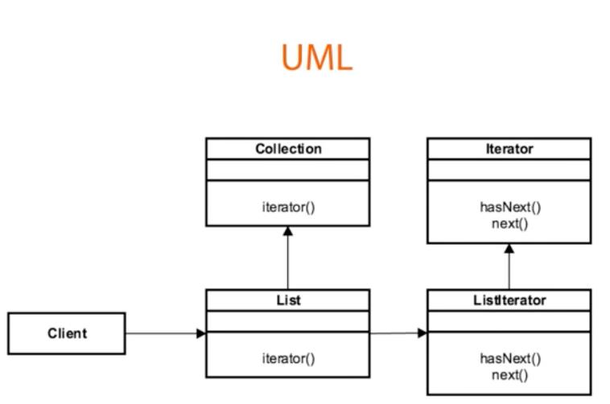

## Introduction ##
- Iterator is a behavioral design pattern that allows sequential traversal through a complex data structure without exposing its internal details.

## Example in Java ##
```java
java.util.iterator
java.util.Enumeration
```

## Design consideration ##


- Collection interfaces is extended by List interface.
- The list interface has among others has iterator factory method
- The iterator factory method returns instance of iterator interface
- ListIterator is implementation of iterator interface that understand how to iterate through the various list object in the collection api.

## Example ##
### Example 1 ###
```java
package example.two;

import java.util.Iterator;

public class BikeRepository implements Iterable<String> {
    private String[] bikes;
    private int index;

    public BikeRepository() {
        this.bikes=new String[10];
        index=0;
    }

    public void addBike(String bike){
        if(index==bikes.length){
            String[] largerBikes=new String[bikes.length+5];
            System.arraycopy(bikes,0,largerBikes,0, bikes.length);
            bikes=largerBikes;
            largerBikes=null;
        }
        bikes[index]=bike;
        index++;
    }


    @Override
    public Iterator<String> iterator() {
        Iterator<String> it=new Iterator<String>() {

            private int currentIndex=0;


            @Override
            public boolean hasNext() {
                return currentIndex<bikes.length&& bikes[currentIndex]!=null;
            }

            @Override
            public String next() {
                return bikes[currentIndex++];
            }

            @Override
            public void remove(){
                throw  new UnsupportedOperationException();
            }
        };
        return it;
    }
}
```

```java
package example.two;

import java.util.Iterator;

public class IteratorDemo {
    public static void main(String [] args){
        BikeRepository repo=new BikeRepository();

        repo.addBike("A");
        repo.addBike("B");
        repo.addBike("C");

        Iterator<String> bikeIterator= repo.iterator();

        for(String bike: repo){
            System.out.println(bike);
        }

    }
}
```

## Limitation  ##
- Unable to access item located at certain index
- It is uni-directional in most cases