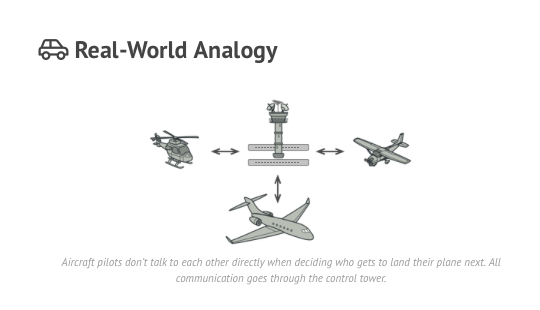
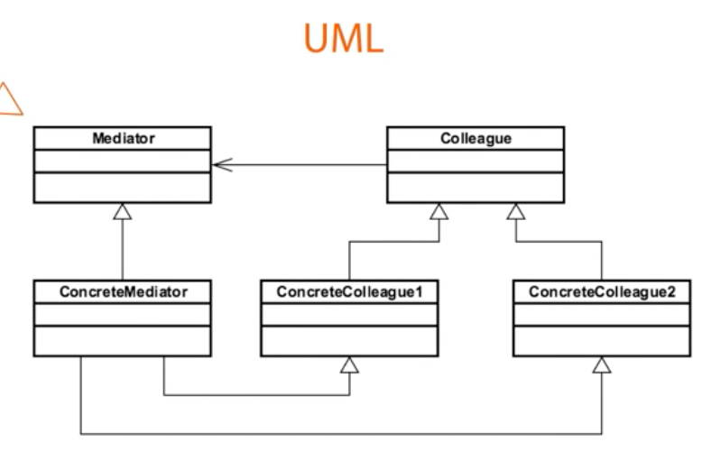

## Introduction ##
 Mediator is a behavioral design pattern that lets you reduce chaotic dependencies between objects. 
 The pattern restricts direct communications between the objects and forces them to collaborate only via a mediator object.
  

## Concept in Java ##
- When loose coupling is required
- When all application is routed

```java
java.util.Timer
java.lang.reflect.Method#invoke()
```
 
## UML ##


- Mediator is an interface or abstract class in most cases.
- If it mediator is an abstract class then it is extended inside concreteMediator
- ConcreteCollegue1 and ConcreteCollege2 don't communicate directly with each other but through mediator.

