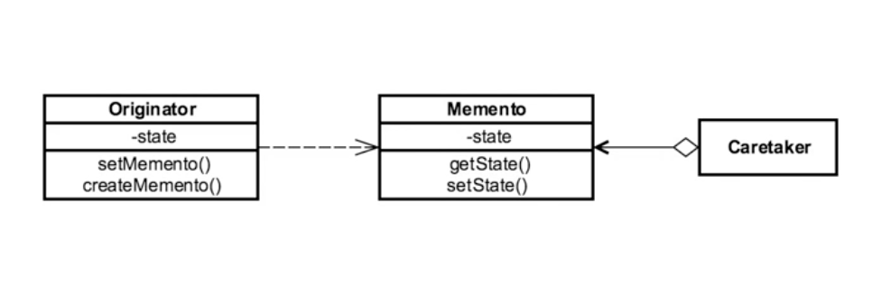

## Introduction ##
- When we need to restore the object to previous state and we achieve this by externalizing object internal state.
- It shields complex internal

## Example in Java ##
```java
java.util.Date
java.io.Serailizable
```

## UML ##



- It is class based design pattern. It has following components:
-  Originator: which is the object which we want to make a copy
- Caretaker: manage the copy or memento that we created
- Memento: represents the copy of the originator that we want to restore

## Example ##
### Example 1 ###
```java
package example.one;

//memento: we have control over the employee fields because we excluded address
public class EmployeeMemento {

    private String name;
    private String phone;

    //Set the state of Employee
    public EmployeeMemento(String name, String phone) {
        this.name = name;
        this.phone = phone;
    }

    //get the state of Employee
    public String getName() {
        return name;
    }

    //get the state of Employee
    public String getPhone() {
        return phone;
    }


}
```

```java
package example.one;

public class Employee {
    private String name;
    private String address;
    private String phone;

    public String getName() {
        return name;
    }

    public void setName(String name) {
        this.name = name;
    }

    public String getAddress() {
        return address;
    }

    public void setAddress(String address) {
        this.address = address;
    }

    public String getPhone() {
        return phone;
    }

    public void setPhone(String phone) {
        this.phone = phone;
    }

    public String toString(){
        return name+" :"+phone;
    }

    public EmployeeMemento save(){
        return new EmployeeMemento(name,phone);
    }

    public void revert(EmployeeMemento employeeMemento){
        this.name=employeeMemento.getName();
        this.phone=employeeMemento.getPhone();
    }
}
```

```java
package example.one;

import java.util.Stack;

//caretaker
public class CareTaker {
    private Stack<EmployeeMemento> employeeHis=new Stack<EmployeeMemento>();

    public void save(Employee emp){
        employeeHis.push(emp.save());
    }

    public void revert(Employee emp){
        emp.revert(employeeHis.pop());
    }
}

```

```java
package example.one;

public class MementoDemo {
    public static void main(String [] args){

        CareTaker careTaker=new CareTaker();
        Employee emp=new Employee();

        emp.setName("Raj Bhatta");
        emp.setAddress("British Columbia");
        emp.setPhone("1112-2222-33");

        System.out.println("Employee before saving"+emp);

        careTaker.save(emp);

        emp.setPhone("444-4444-4444");

        System.out.println("Employee after changed phone number save"+emp);
        emp.setPhone("333-999-6666");

        careTaker.revert(emp);

        System.out.println("Revert to last save point: "+emp);
        careTaker.revert(emp);


    }
}
```