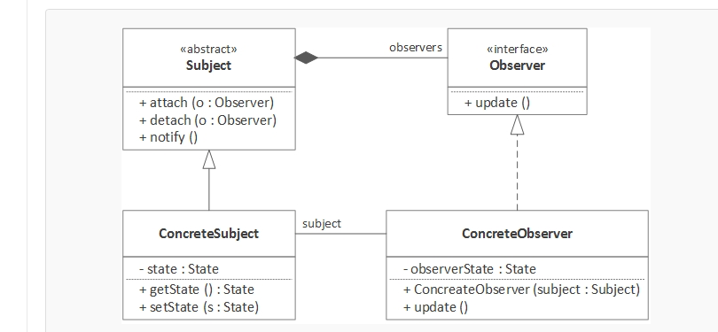

## Introduction ##
- The observer pattern defines a one-to-many dependency between objects so that when one object changes state, all of its dependents are notified and updated automatically. 

## Example in Java ##
```java
java.util.Observer
java.util.EventListener
java.jms.Topic
```

## Design consideration ##
- Subject – interface or abstract class defining the operations for attaching and de-attaching observers to the subject.
- ConcreteSubject – concrete Subject class. It maintain the state of the object and when a change in the state occurs it notifies the attached Observers.
- Observer – interface or abstract class defining the operations to be used to notify this object.
- ConcreteObserver – concrete Observer implementations.

## UML ##


## Example ##
### Example 1 ###
```java
package example.one;

import java.util.ArrayList;
import java.util.List;

public abstract class Subject {
    private List<Observer> observerList=new ArrayList<Observer>();

    abstract void setState(String state);
    abstract String getState();

    public void attach(Observer observer){
        observerList.add(observer);
    }

    public void detach(Observer observer){
        observerList.remove(observer);
    }

    public void notifyObservers(){
        for(Observer observer: observerList){
            observer.update();
        }
    }
}

```

```java
package example.one;

import java.util.ArrayDeque;
import java.util.Deque;

//Concrete subject
public class MessageStream extends Subject {

    private Deque<String> messageHistory=new ArrayDeque<String>();


    void setState(String message) {
        messageHistory.add(message);
        this.notifyObservers();
    }

    String getState() {
        return messageHistory.getLast();
    }
}

```

```java
package example.one;

public abstract class Observer {

    //Reference of the subject is stored here
    protected Subject subject;
    abstract void update();
}

```

```java
package example.one;

//Concrete observer
public class PhoneClient extends Observer{

    Subject subject;

    public PhoneClient(Subject subject) {
        this.subject = subject;
        subject.attach(this);
    }

    public void addMessage(String message){
        subject.setState(message+ " - sent from phone");
    }

    void update() {
        System.out.println("Phone Stream: "+subject.getState());
    }
}

```

```java
package example.one;

public class ObserverDemo {
    public static void main(String [] args){
        Subject subject=new MessageStream();

        PhoneClient phoneClient=new PhoneClient(subject);
        phoneClient.addMessage("hello");

        TabletClient tabletClient=new TabletClient(subject);
        tabletClient.addMessage("hello another");

    }
}

```