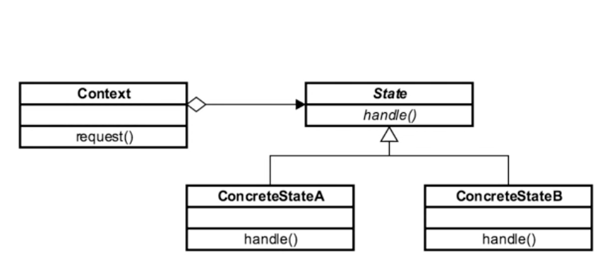

## Introduction ##
State is a behavioral design pattern that allows an object to change the behavior when its internal state changes.

## Design consideration ##
- It is based on abstract class or interface
- Each state is represented by concrete class
- The context or subject that has multiple state are unaware of this pattern


## UML ##



## Example ##
Problem
```java
package example.one.problem;

public class Fan {
    final static int OFF=0;
    final static int LOW=1;
    final static int MED=2;

    int state=OFF;

    public Fan() {
    }

    public void pullChain() {
        if(state==OFF){
            System.out.println("Turning fan on to low.");
            state=LOW;
        }
        else if(state==LOW){
            System.out.println("Turning fan on to med");
            state=MED;
        }
        else if(state==MED){
            System.out.println("Turning fan med");
            state=OFF;
        }
    }

    public String toString(){
        if(state==OFF){
            return "Fan is off";
        }else if(state==LOW){
            return "Fan is on low";
        }else if(state==MED){
            return "Fan is on medium";
        }
        return "Invalid state";
    }
}

```
```java
package example.one.problem;

public class StateDemo {
    public static void main(String [] args){
        Fan fan=new Fan();

        System.out.println(fan);

        fan.pullChain();

        System.out.println(fan);

        fan.pullChain();
        
        System.out.print(fan);

    }
}

```

Solution
```java
package example.one.solution;

public abstract class State {
    public void handleRequest(){
        System.out.println("Shouldn't able to get here");
    }
}

```

```java
package example.one.solution;

public class Fan {

    State fanOffState;
    State fanLowState;
    State fanMedState;
    State fanHighState;

    State state;

    public Fan() {
        fanOffState=new FanOffState(this);
        fanLowState=new FanLowState(this);
        fanMedState=new FanMedState(this);
        fanHighState=new FanHighState(this);

        state=fanOffState;
    }

    public void pullChain() {
        state.handleRequest();
    }

    public String toString(){
        return state.toString();
    }

    public State getFanLowState() {
        return fanOffState;
    }

    public void setState(State state){
        this.state=state;
    }

    public State getFanMediumState() {
        return fanMedState;
    }

    public State getFanOffState() {
        return fanOffState;
    }

    public State getFanHighState() {
        return fanHighState;
    }

    public State getFanMedState() {
        return fanMedState;
    }

}

```

```java
package example.one.solution;

public class FanOffState extends State {

    private Fan fan;

    public FanOffState(Fan fan) {
        this.fan = fan;
    }

    @Override
    public void handleRequest(){
        System.out.println("Turning fan on to low.");
        fan.setState(fan.getFanLowState());
    }

    public String toString(){
        return "Fan is off";
    }
}

```

```java
package example.one.solution;

public class FanMedState extends State{
    private Fan fan;

    public FanMedState(Fan fan) {
        this.fan = fan;
    }

    @Override
    public void handleRequest(){
        System.out.println("Turning fan on to high.");
        fan.setState(fan.getFanHighState());
    }

    public String toString(){
        return "Fan is medium";
    }
}

```

```java
package example.one.solution;

public class FanLowState extends State {

    private Fan fan;

    public FanLowState(Fan fan) {
        this.fan = fan;
    }

    @Override
    public void handleRequest(){
        System.out.println("Turning fan on to medium.");
        fan.setState(fan.getFanMediumState());
    }

    public String toString(){
        return "Fan is low";
    }
}

```

```java
package example.one.solution;

public class FanHighState extends State {
    private Fan fan;

    public FanHighState(Fan fan) {
        this.fan = fan;
    }

    @Override
    public void handleRequest(){
        System.out.println("Turning fan off.");
        fan.setState(fan.getFanOffState());
    }

    public String toString(){
        return "Fan is high";
    }
}

```

```java
package example.one.solution;

public class StateDemo {
    public static void main(String [] args){
        Fan fan=new Fan();

        System.out.println(fan);

        fan.pullChain();

        System.out.println(fan);

        fan.pullChain();

        System.out.print(fan);

    }
}

```