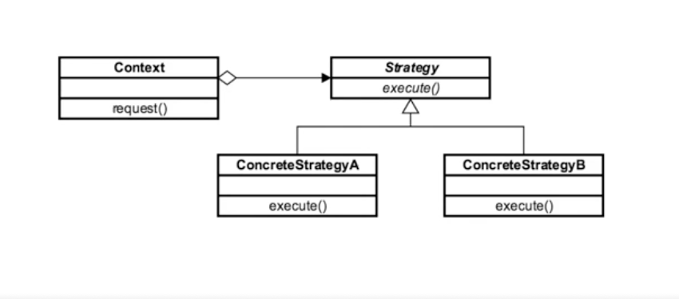
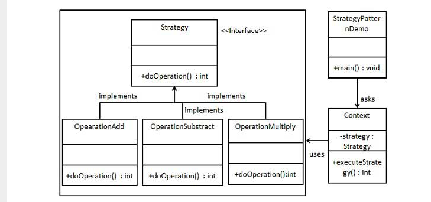

## Introduction ##
- When we need to eliminate conditional statement then we need to use strategy pattern
- If it is difficult to add new strategies or cases inside the application then we need to use strategy design pattern
- When it is used, client is aware about strategies or cases


## Example ##
```java
java.util.Comparator
```

## Design consideration ##
- Can be implemented using interfaces but abstract base class is preferred.
- All the concrete classes are implemented per strategy or case.
- We want to minimize or eliminate if/else condition
- Strategies doesn't know about each other

## UML ##
- The context receives the request and decides which strategy to used based on the situation or case


## Example ##
### Example 1 ###
```java
package example.one;

//Strategy
public abstract class ValidationStrategy {
    public abstract boolean isValid(CreditCard creditCard);

    protected boolean validateCreditCardNumber(String str) {

        int[] ints = new int[str.length()];
        for (int i = 0; i < str.length(); i++) {
            ints[i] = Integer.parseInt(str.substring(i, i + 1));
        }
        for (int i = ints.length - 2; i >= 0; i = i - 2) {
            int j = ints[i];
            j = j * 2;
            if (j > 9) {
                j = j % 10 + 1;
            }
            ints[i] = j;
        }
        int sum = 0;
        for (int i = 0; i < ints.length; i++) {
            sum += ints[i];
        }
        if (sum % 10 == 0) {
            return true;
        } else {
           return false;
        }
    }


}

```
```java
package example.one;

public class CreditCard {
    private String number;
    private String date;
    private String cvv;

    private ValidationStrategy strategy;

    public CreditCard(ValidationStrategy strategy) {
        this.strategy = strategy;
    }

    public boolean isValid(){
        return strategy.isValid(this);
    }

    public String getNumber() {
        return number;
    }

    public void setNumber(String number) {
        this.number = number;
    }

    public String getDate() {
        return date;
    }

    public void setDate(String date) {
        this.date = date;
    }

    public String getCvv() {
        return cvv;
    }

    public void setCvv(String cvv) {
        this.cvv = cvv;
    }
}

```

```java
package example.one;

//American express strategy
public class AmexStrategy extends ValidationStrategy {

    public boolean isValid(CreditCard creditCard) {
        boolean isValid=true;

        isValid=creditCard.getNumber().startsWith("37")||
                creditCard.getNumber().startsWith("34");

        if(isValid){
            isValid=creditCard.getNumber().length()==15;
        }

        if(isValid){
            isValid=validateCreditCardNumber(creditCard.getNumber());
        }

        return isValid;
    }
}

```

```java
package example.one;

public class StrategyDemo {
    public static void main(String[] args){
        CreditCard amexCard=new CreditCard(new AmexStrategy());
        amexCard.setNumber("379185883464283");
        amexCard.setDate("04/2020");
        amexCard.setCvv("123");

        System.out.println("Is Amex valid:"+amexCard.isValid());


        CreditCard amexCard2=new CreditCard(new AmexStrategy());
        amexCard.setNumber("379185883464282");
        amexCard.setDate("04/2017");
        amexCard.setCvv("234");

        System.out.println("Is Amex valid:"+amexCard.isValid());

    }
}

```

### Example 2 ###


```java
package example.two;

public interface Strategy {
    public int doOperation(int num1, int num2);
}
```

```java
package example.two;

public class OperationAdd implements Strategy {
    public int doOperation(int num1, int num2) {
        return num1 + num2;
    }
}
```

```java

package example.two;

public class OperationMultiply implements Strategy {
    public int doOperation(int num1, int num2) {
        return num1 * num2;
    }
}
```

```java
package example.two;

public class OperationSubstract implements Strategy {
    public int doOperation(int num1, int num2) {
        return num1 - num2;
    }
}

```

```java
package example.two;

public class Context {
    private Strategy strategy;

    public Context(Strategy strategy){
        this.strategy = strategy;
    }

    public int executeStrategy(int num1, int num2){
        return strategy.doOperation(num1, num2);
    }
}
```

```java
package example.two;

public class StrategyPatternDemo {
    public static void main(String[] args) {
        Context context = new Context(new OperationAdd());
        System.out.println("10 + 5 = " + context.executeStrategy(10, 5));

        context = new Context(new OperationSubstract());
        System.out.println("10 - 5 = " + context.executeStrategy(10, 5));

        context = new Context(new OperationMultiply());
        System.out.println("10 * 5 = " + context.executeStrategy(10, 5));
    }
}

```
