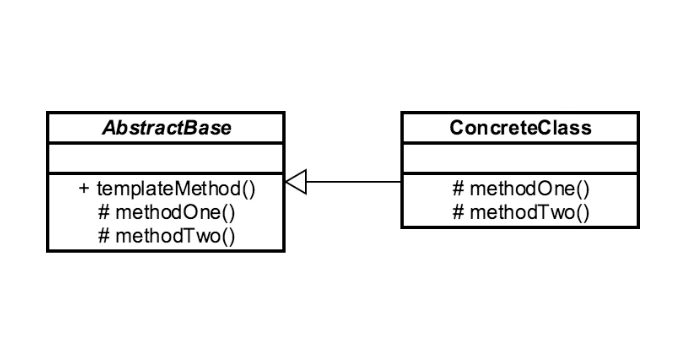

## Introduction ##
Template Method is a behavioral design pattern that defines the skeleton of an algorithm in the superclass but lets subclasses override specific steps of the algorithm without changing its structure.

## Example ##
```java
java.util.Collection#sort()
java.util.AbstractList#indexOf()
```

## UML ##
- It is based on abstract class, which is implemented by child class.

