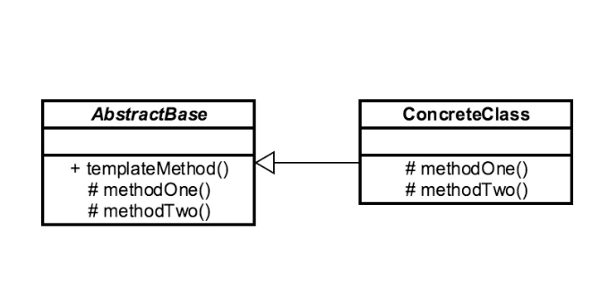

## Introduction ##
Template Method is a behavioral design pattern that defines the skeleton of an algorithm in the superclass but lets subclasses override specific steps of the algorithm without changing its structure.

## Example ##
```java
java.util.Collection#sort()
java.util.AbstractList#indexOf()
```

## UML ##
- It is based on abstract class, which is implemented by child class.


## Example ##
```java
package example;

public abstract class OrderProcessTemplate {
    public boolean isGift;

    public abstract void doSelect();

    public abstract void doPayment();

    public final void giftWrap()
    {
        try
        {
            System.out.println("Gift wrap successful");
        }
        catch (Exception e)
        {
            System.out.println("Gift wrap unsuccessful");
        }
    }

    public abstract void doDelivery();

    public final void processOrder(boolean isGift)
    {
        doSelect();
        doPayment();
        if (isGift) {
            giftWrap();
        }
        doDelivery();
    }
}
```

```java
package example;

public class NetOrder extends OrderProcessTemplate
{
    @Override
    public void doSelect()
    {
        System.out.println("Item added to online shopping cart");
        System.out.println("Get gift wrap preference");
        System.out.println("Get delivery address.");
    }

    @Override
    public void doPayment()
    {
        System.out.println
                ("Online Payment through Netbanking, card or Paytm");
    }

    @Override
    public void doDelivery()
    {
        System.out.println
                ("Ship the item through post to delivery address");
    }
}
```

```java
package example;

public class StoreOrder extends OrderProcessTemplate
{

    @Override
    public void doSelect()
    {
        System.out.println("Customer chooses the item from shelf.");
    }

    @Override
    public void doPayment()
    {
        System.out.println("Pays at counter through cash/POS");
    }

    @Override
    public void doDelivery()
    {
        System.out.println("Item delivered to in delivery counter.");
    }

}
``` 

```java
package example;

public class DemoTemplateMethodPattern {
    public static void main(String[] args){
        OrderProcessTemplate netOrder = new NetOrder();
        netOrder.processOrder(true);
        System.out.println();
        OrderProcessTemplate storeOrder = new StoreOrder();
        storeOrder.processOrder(true);
    }
}
```
