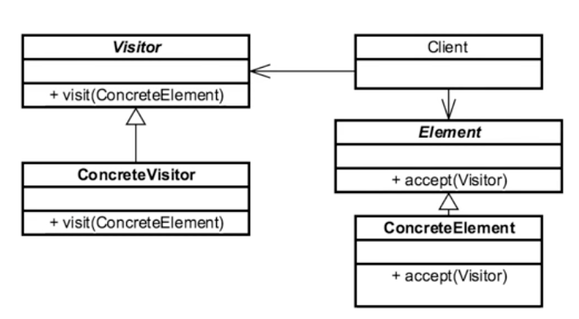

## Introduction ##
When we want to separate algorithm from object structure. The condition is that we are adding new feature but we can't change the existing object.

## Example in Java ##
```java
java.lang.model.element.Element
java.lang.model.element.ElementModel
```

## Design Consideration ##
- It is an interface based
- The application has element and these element are the pieces expect to change and need add functionality over time.
- The way we add change is by implementing visitor in each element. Each element has visit method and each visitor knows every element.

## UML ##


## Example ##
### Example 1 ###
Problems
```java
package example.one.problem;

public interface AtvPart {
    public double calculateShipping();

}

```

```java
package example.one.problem;

public class Fender implements AtvPart {
    @Override
    public double calculateShipping() {
        return 3;
    }
}

```

```java
package example.one.problem;

public class Oil implements AtvPart {

    @Override
    public double calculateShipping() {
        return 9;
    }
}

```

```java
package example.one.problem;

public class Wheel implements AtvPart {

    @Override
    public double calculateShipping() {
        return 12;
    }
}

```

```java
package example.one.problem;

import java.util.ArrayList;
import java.util.Collections;
import java.util.List;

public class PartsOrder {
    private List<AtvPart> parts=new ArrayList<>();

    public PartsOrder() {
    }

    public void addPart(AtvPart atvPart){
        parts.add(atvPart);
    }

    public List<AtvPart> getParts(){
        return Collections.unmodifiableList(parts);
    }

    public double calculateShipping(){
        double shippingCost=0;
        for(AtvPart atvPart:parts){
            shippingCost+=atvPart.calculateShipping();
        }
        return shippingCost;
    }
}

```

```java
package example.one.problem;

public class VisitorDemo {
    public static void main(String [] args){
        PartsOrder order=new PartsOrder();
        order.addPart(new Wheel());
        order.addPart(new Fender());
        order.addPart(new Oil());

        double shippingCost=order.calculateShipping();

        System.out.println(shippingCost);

    }
}

```
